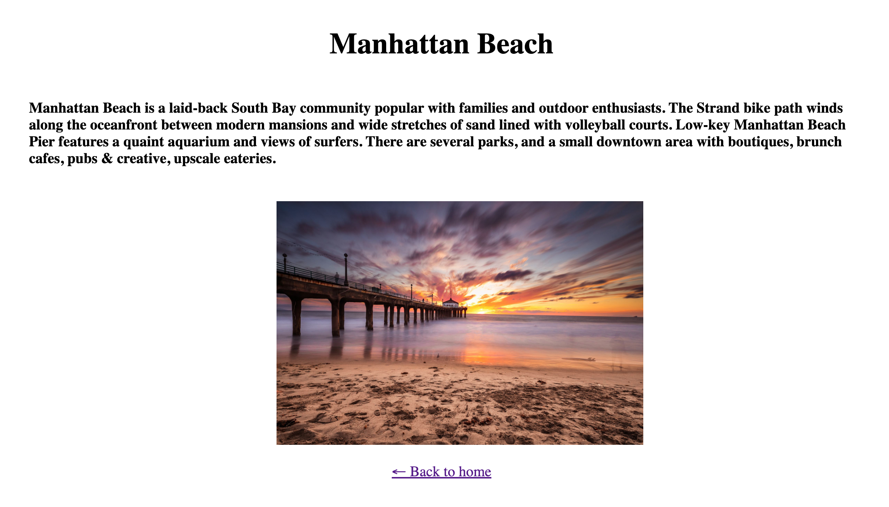

<p align="center"></p>
<h2 align="center">NYC Guide Django Project</h2>
<h4 align="center">By Chung Kao & Donell Jenkins</h4>
<p align="center">Columbia University - Justice Through Code</p>
<p align="center"></p>

## About

This is a simeple Django app in which users may navigate the site via the links provided and check out famous places in New York City by. It is created collaboratively by Donell Jenkins and Chung Kao to fulfill a project requirement for the Columbia University's Justice Through Code, Spring 2022 program. Participants of JTC undergo an intensive of Python programming and app development using the Django framework. This is Project 2 of the two projects that will have been completed before the final project and before participants move on to the career development phase of the program.

### Usage

To clone a copy of this project using https, run the following command in the command line:

```bash
$ git clone https://github.com/Sanlung/jtc-nyc-guide.git <your_project_directory_name>
```

To clone using SSH run the following command:

```bash
$ git clone git@github.com/Sanlung/jtc-nyc-guide.git <your_project_directory_name>
```

In the same directory as `<your_local_project_name>/sandwichsite/sandwichsite/settings.py` file, create a `.env` file and, in it, save a secret key that you create. You may generate a key in the terminal like so:

```bash
$ shasum<<<test
```

A hash will be generated and printed to the terminal, which you can use as the key and save it in the `.env` file, like so:

```.env
SECRET_KEY=<the_hash_you_generated>
```

Create a Python virtual environment and activate it in your local project: (assuming you already have Python installed)

```bash
$ cd <your_local_project_directory_name>
$ python3 -m venv venv
$ . venv/bin/activate
```

Install the packages from `requirements.txt`:

```bash
$ pip install -r requirements.txt
```

In the `sandwichsite/` directory run the following command to start the server:

```bash
$ cd sandwichsite
$ python3 manage.py runserver
```

And you can take the app further with your own tweaks. The steps in the above are for Mac and Linux users. Please look up online for equivalent commands for Windows machines.

### Author

[](https://github.com/Djenkins1221) [](https://github.com/Sanlung)
